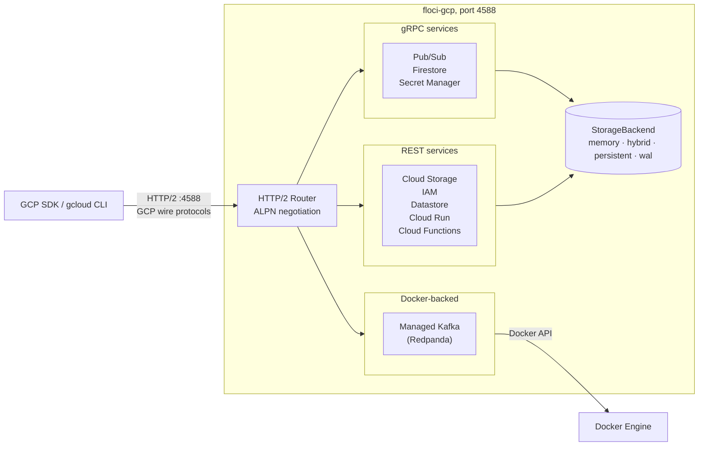

<p align="center">
  
  
</p>

<p align="center">
  <strong>Light, fluffy, and always free — GCP Local Emulator</strong><br />
  No account. No auth token. No feature gates. Just <code>docker compose up</code>.
</p>

<p align="center">
  <a href="https://github.com/floci-io/floci-gcp/releases/latest"></a>
  <a href="https://github.com/floci-io/floci-gcp/actions/workflows/release.yml"></a>
  <a href="https://hub.docker.com/r/floci/floci-gcp"></a>
  <a href="https://hub.docker.com/r/floci/floci-gcp"></a>
  <a href="https://opensource.org/licenses/MIT"></a>
  <a href="https://github.com/floci-io/floci-gcp/stargazers"></a>
</p>

<p align="center">
  <a href="#quick-start">Quick Start</a> ·
  <a href="#features">Features</a> ·
  <a href="#supported-services">Services</a> ·
  <a href="#sdk-integration">SDKs</a> ·
  <a href="#testcontainers">Testcontainers</a> ·
  <a href="#compatibility-testing">Compatibility</a> ·
  <a href="https://floci.io/floci-gcp/">Docs</a>
</p>

---

## What is floci-gcp?

floci-gcp is a free, open-source local GCP emulator for development, testing, and CI.

It gives you GCP-shaped services on your machine without requiring a cloud account, auth token, or paid feature gates. Point your GCP SDK, gcloud CLI, Terraform, or test suite at `http://localhost:4588` and keep your existing workflows.

floci-gcp is named after [floccus](https://en.wikipedia.org/wiki/Cirrocumulus_floccus), the cloud formation that looks like popcorn.

## Quick Start

```yaml
# docker-compose.yml
services:
  floci-gcp:
    image: floci/floci-gcp:latest
    ports:
      - "4588:4588"
    volumes:
      - ./data:/app/data
    environment:
      FLOCI_GCP_HOSTNAME: floci-gcp
      FLOCI_GCP_BASE_URL: http://floci-gcp:4588
```

```bash
docker compose up -d
```

Export the GCP emulator environment variables:

```bash
export PUBSUB_EMULATOR_HOST=localhost:4588
export FIRESTORE_EMULATOR_HOST=localhost:4588
export DATASTORE_EMULATOR_HOST=localhost:4588
export STORAGE_EMULATOR_HOST=http://localhost:4588
export SECRET_MANAGER_EMULATOR_HOST=localhost:4588
export GOOGLE_CLOUD_PROJECT=floci-local
```

All GCP services are available at `http://localhost:4588`. Credentials are not validated.

<details>
<summary>Using Docker directly?</summary>

```bash
docker run -d --name floci-gcp \
  -p 4588:4588 \
  floci/floci-gcp:latest
```

</details>

## Features

<details open>
<summary><strong>Local GCP without the cloud account</strong></summary>

Run GCP-compatible services locally without a GCP account, service account key, or paid feature gates.

</details>

<details>
<summary><strong>Single port for everything</strong></summary>

All GCP services — gRPC and REST — share a single port (`4588`) via HTTP/2 ALPN negotiation. No per-service daemon setup, no port management.

</details>

<details>
<summary><strong>Real GCP wire protocols</strong></summary>

floci-gcp speaks the same protocols as real GCP: protobuf-over-gRPC for Pub/Sub, Firestore, and Secret Manager; binary HTTP/protobuf for Datastore; REST XML and JSON for Cloud Storage; and REST JSON for management APIs such as Cloud Run and Cloud Functions. Existing SDK calls work without modification.

</details>

<details>
<summary><strong>Fast enough for CI</strong></summary>

The native image starts in milliseconds and keeps idle memory low, making it practical for local development and test pipelines.

</details>

<details>
<summary><strong>Configurable persistence</strong></summary>

Choose from in-memory, persistent, hybrid, and write-ahead log storage depending on the durability profile you need.

</details>

## Why floci-gcp?

GCP's official emulators are fragmented — each service ships its own binary, runs on a different port, and requires separate setup. floci-gcp unifies them under a single port.

| Capability | floci-gcp | GCP official emulators |
|---|:---:|:---:|
| Single port for all services | ✅ | ❌ |
| gRPC + REST on the same port | ✅ | ❌ |
| No GCP account required | ✅ | ✅ |
| Pub/Sub | ✅ | ✅ |
| Firestore | ✅ | ✅ |
| Datastore | ✅ | ✅ |
| Cloud Storage (GCS) | ✅ | ⚠️ Limited |
| Secret Manager | ✅ | ❌ |
| IAM | ✅ | ❌ |
| Managed Kafka | ✅ | ❌ |
| Cloud Run | ✅ | ❌ |
| Cloud Functions | ✅ | ❌ |
| Native binary | ✅ | ❌ |

## Architecture Overview



## Supported Services

floci-gcp emulates GCP services across storage, messaging, identity, and managed infrastructure.

| Category | Services |
|---|---|
| Object and document storage | Cloud Storage (GCS), Firestore, Datastore |
| Messaging | Pub/Sub, Managed Kafka |
| Security and identity | Secret Manager, IAM |
| Serverless control planes | Cloud Run, Cloud Functions |

<details>
<summary>Detailed service notes</summary>

| Service | Protocol | Notable features |
|---|---|---|
| **Cloud Storage (GCS)** | REST XML + REST JSON | Buckets, objects, multipart upload, object compose, ACLs, bucket IAM, conditional requests (preconditions), versioning, lifecycle, CORS, pre-signed URLs (V4) |
| **Pub/Sub** | gRPC | Topics, subscriptions, publish, pull, streaming pull, push delivery, snapshots, seek, field masks on update |
| **Firestore** | gRPC | Documents, collections, queries (all operators), field transforms, aggregation (COUNT), transactions, batch writes, real-time listeners (`listen` stream) |
| **Datastore** | HTTP/protobuf | Entities, structured queries, GQL queries, aggregation (COUNT), transactions, GQL named/positional bindings |
| **Secret Manager** | gRPC | Secrets, versioning, access, `versions/latest` alias, disable/enable/destroy, IAM bindings |
| **IAM** | REST JSON | Service accounts, RSA-2048 key pairs (JSON key file format), policy bindings, `SignBlob` (V4 signed URLs) |
| **Managed Kafka** | REST JSON | Clusters, topics, consumer groups; Redpanda-backed or mock mode |
| **Cloud Run** | REST JSON | Services, IAM policies, revisions, long-running operations; control plane only, no runtime invocation |
| **Cloud Functions** | REST JSON | Functions, source upload URL generation, long-running operations; control plane only, no runtime invocation |

</details>

## Persistence & Storage Modes

floci-gcp supports flexible storage modes. Configure globally via `FLOCI_GCP_STORAGE_MODE`.

| Mode | Behavior | Best for | Durability |
|:---:|---|---|:---:|
| **`memory`** | **(Default)** Entirely in-RAM. Lost on container stop. | Speed, CI pipelines | ❌ None |
| **`persistent`** | Every write goes directly to disk synchronously. | Durable local dev | ✅ Good |
| **`hybrid`** | In-memory with async flush every 5 seconds. | Balance of speed and safety | ✅ Good |
| **`wal`** | Write-Ahead Log. Every mutation written to disk immediately. | Maximum durability | 💎 Highest |

Use `memory` for fast CI runs. Use `hybrid` when you want state preserved across container restarts.

## Multi-Project Isolation

GCP resource names follow `projects/{project}/...`. floci-gcp uses the project ID as the multi-tenancy boundary — resources in `project-a` are invisible to `project-b`.

The project ID is resolved in this order:
1. URL path segment `projects/{project}/...`
2. `x-goog-request-params` header (`project=...`)
3. `FLOCI_GCP_DEFAULT_PROJECT_ID` fallback (default: `floci-local`)

```bash
# Two projects, full isolation
export PUBSUB_EMULATOR_HOST=localhost:4588

gcloud pubsub topics create my-topic --project=project-a
gcloud pubsub topics create my-topic --project=project-b

# Each project has its own independent topic
```

## SDK Integration

Point your existing GCP SDK at `http://localhost:4588`.

<details>
<summary><strong>Java (GCP SDK)</strong></summary>

```java
// Pub/Sub
ManagedChannel channel = ManagedChannelBuilder
    .forTarget("localhost:4588")
    .usePlaintext()
    .build();

TransportChannelProvider channelProvider =
    FixedTransportChannelProvider.create(GrpcTransportChannel.create(channel));
CredentialsProvider credentialsProvider = NoCredentialsProvider.create();

TopicAdminClient topicClient = TopicAdminClient.create(
    TopicAdminSettings.newBuilder()
        .setTransportChannelProvider(channelProvider)
        .setCredentialsProvider(credentialsProvider)
        .build());

topicClient.createTopic(TopicName.of("floci-local", "my-topic"));
```

```java
// Cloud Storage
Storage storage = StorageOptions.newBuilder()
    .setHost("http://localhost:4588")
    .setProjectId("floci-local")
    .setCredentials(NoCredentials.getInstance())
    .build()
    .getService();

storage.create(BucketInfo.of("my-bucket"));
storage.create(BlobInfo.newBuilder("my-bucket", "hello.txt").build(),
    "hello from floci-gcp".getBytes());
```

```java
// Firestore
FirestoreOptions options = FirestoreOptions.newBuilder()
    .setHost("localhost:4588")
    .setProjectId("floci-local")
    .setCredentials(NoCredentials.getInstance())
    .build();

Firestore db = options.getService();
db.collection("users").add(Map.of("name", "Alice", "age", 30)).get();
```

</details>

<details>
<summary><strong>Python (google-cloud)</strong></summary>

```python
import os
os.environ["PUBSUB_EMULATOR_HOST"] = "localhost:4588"

from google.cloud import pubsub_v1

publisher = pubsub_v1.PublisherClient()
topic_path = publisher.topic_path("floci-local", "my-topic")
publisher.create_topic(request={"name": topic_path})
future = publisher.publish(topic_path, b"hello from floci-gcp")
future.result()
```

```python
import os
os.environ["STORAGE_EMULATOR_HOST"] = "http://localhost:4588"

from google.cloud import storage

client = storage.Client(project="floci-local")
bucket = client.bucket("my-bucket")
client.create_bucket(bucket)

blob = bucket.blob("hello.txt")
blob.upload_from_string("hello from floci-gcp")
print(blob.download_as_text())
```

```python
import os
os.environ["FIRESTORE_EMULATOR_HOST"] = "localhost:4588"

from google.cloud import firestore

db = firestore.Client(project="floci-local")
db.collection("users").add({"name": "Alice", "age": 30})
docs = db.collection("users").where("name", "==", "Alice").stream()
for doc in docs:
    print(doc.to_dict())
```

</details>

<details>
<summary><strong>Node.js</strong></summary>

```javascript
import { PubSub } from "@google-cloud/pubsub";

process.env.PUBSUB_EMULATOR_HOST = "localhost:4588";

const pubsub = new PubSub({ projectId: "floci-local" });
await pubsub.createTopic("my-topic");
const [subscription] = await pubsub.topic("my-topic").createSubscription("my-sub");
```

```javascript
import { Storage } from "@google-cloud/storage";

const storage = new Storage({
  apiEndpoint: "http://localhost:4588",
  projectId: "floci-local",
});

await storage.createBucket("my-bucket");
await storage.bucket("my-bucket").file("hello.txt").save("hello from floci-gcp");
```

</details>

<details>
<summary><strong>Go</strong></summary>

```go
package main

import (
    "context"
    "fmt"
    "log"

    "cloud.google.com/go/pubsub"
    "google.golang.org/api/option"
    "google.golang.org/grpc"
    "google.golang.org/grpc/credentials/insecure"
)

func main() {
    ctx := context.Background()

    conn, err := grpc.Dial("localhost:4588", grpc.WithTransportCredentials(insecure.NewCredentials()))
    if err != nil {
        log.Fatal(err)
    }

    client, err := pubsub.NewClient(ctx, "floci-local",
        option.WithGRPCConn(conn))
    if err != nil {
        log.Fatal(err)
    }
    defer client.Close()

    topic, err := client.CreateTopic(ctx, "my-topic")
    if err != nil {
        log.Fatal(err)
    }

    fmt.Println("Created topic:", topic.ID())
}
```

</details>

<details>
<summary><strong>Bash (gcloud CLI)</strong></summary>

```bash
export PUBSUB_EMULATOR_HOST=localhost:4588
gcloud config set project floci-local

# Pub/Sub
gcloud pubsub topics create my-topic
gcloud pubsub subscriptions create my-sub --topic=my-topic
gcloud pubsub topics publish my-topic --message="hello from floci-gcp"
gcloud pubsub subscriptions pull my-sub --auto-ack

# Cloud Storage
export STORAGE_EMULATOR_HOST=http://localhost:4588
gcloud storage buckets create gs://my-bucket
echo "hello" | gcloud storage cp - gs://my-bucket/hello.txt
gcloud storage ls gs://my-bucket

# Secret Manager
export SECRET_MANAGER_EMULATOR_HOST=localhost:4588
gcloud secrets create my-secret --replication-policy=automatic
echo -n "my-value" | gcloud secrets versions add my-secret --data-file=-
gcloud secrets versions access latest --secret=my-secret
```

</details>

## Testcontainers

Use `GenericContainer` to start an isolated floci-gcp instance directly from your tests. This avoids shared state, manual daemon setup, and port conflicts.

<details>
<summary><strong>Java</strong></summary>

```java
@Testcontainers
class PubSubIntegrationTest {

    @Container
    static GenericContainer<?> flociGcp = new GenericContainer<>("floci/floci-gcp:latest")
        .withExposedPorts(4588)
        .waitingFor(Wait.forHttp("/_floci/health").forPort(4588));

    static TopicAdminClient topicClient;

    @BeforeAll
    static void setup() throws Exception {
        String host = flociGcp.getHost();
        int port = flociGcp.getMappedPort(4588);

        ManagedChannel channel = ManagedChannelBuilder
            .forAddress(host, port)
            .usePlaintext()
            .build();

        topicClient = TopicAdminClient.create(
            TopicAdminSettings.newBuilder()
                .setTransportChannelProvider(
                    FixedTransportChannelProvider.create(GrpcTransportChannel.create(channel)))
                .setCredentialsProvider(NoCredentialsProvider.create())
                .build());
    }

    @Test
    void shouldCreateTopic() {
        topicClient.createTopic(TopicName.of("floci-local", "test-topic"));
    }
}
```

</details>

<details>
<summary><strong>Python</strong></summary>

```python
import pytest
from testcontainers.core.container import DockerContainer
from google.cloud import pubsub_v1


@pytest.fixture(scope="session")
def floci_gcp():
    with DockerContainer("floci/floci-gcp:latest").with_exposed_ports(4588) as container:
        container.get_exposed_port(4588)  # wait for startup
        yield container


def test_pubsub(floci_gcp):
    port = floci_gcp.get_exposed_port(4588)
    host = floci_gcp.get_container_host_ip()

    import os
    os.environ["PUBSUB_EMULATOR_HOST"] = f"{host}:{port}"

    publisher = pubsub_v1.PublisherClient()
    topic_path = publisher.topic_path("floci-local", "test-topic")
    publisher.create_topic(request={"name": topic_path})
```

</details>

## Compatibility Testing

The [`compatibility-tests`](./compatibility-tests/) directory validates floci-gcp across SDKs and IaC tools.

| Module | Language / Tool | SDK / Client |
|---|---|---|
| `sdk-test-java` | Java | GCP SDK for Java |
| `sdk-test-node` | Node.js | `@google-cloud/*` |
| `sdk-test-python` | Python | `google-cloud-*` |
| `sdk-test-go` | Go | `cloud.google.com/go/*` |
| `compat-terraform` | Terraform | Google provider |
| `compat-opentofu` | OpenTofu | Google provider |

Run the full suite:

```bash
cd compatibility-tests && just test-java
cd compatibility-tests && just test-go
cd compatibility-tests && just test-terraform
```

## Image Tags

Every tag combines a variant and a channel.

| Channel | Tag |
|---|---|
| Release, floating | `latest` |
| Release, pinned | `x.y.z` |
| Nightly, floating | `nightly` |
| Nightly, dated | `nightly-mmddyyyy` |

Use `latest` for stable releases, a pinned version for reproducible builds, and `nightly` to track `main`.

```yaml
# Recommended
image: floci/floci-gcp:latest

# Pinned release
image: floci/floci-gcp:1.0.0

# Track main
image: floci/floci-gcp:nightly
```

## Configuration

All settings are overridable via environment variables (`FLOCI_GCP_` prefix).

| Variable | Default | Description |
|---|---|---|
| `FLOCI_GCP_PORT` | `4588` | Port for all services (gRPC + REST) |
| `FLOCI_GCP_DEFAULT_PROJECT_ID` | `floci-local` | Default GCP project ID |
| `FLOCI_GCP_BASE_URL` | `http://localhost:4588` | Base URL returned in service responses |
| `FLOCI_GCP_HOSTNAME` | *(unset)* | Hostname to use in returned URLs when running inside Docker Compose |
| `FLOCI_GCP_STORAGE_MODE` | `memory` | Storage mode: `memory` · `persistent` · `hybrid` · `wal` |
| `FLOCI_GCP_STORAGE_PERSISTENT_PATH` | `./data` | Directory for persisted state |
| `FLOCI_GCP_SERVICES_GCS_ENABLED` | `true` | Enable/disable Cloud Storage |
| `FLOCI_GCP_SERVICES_PUBSUB_ENABLED` | `true` | Enable/disable Pub/Sub |
| `FLOCI_GCP_SERVICES_FIRESTORE_ENABLED` | `true` | Enable/disable Firestore |
| `FLOCI_GCP_SERVICES_DATASTORE_ENABLED` | `true` | Enable/disable Datastore |
| `FLOCI_GCP_SERVICES_IAM_ENABLED` | `true` | Enable/disable IAM |
| `FLOCI_GCP_SERVICES_SECRETMANAGER_ENABLED` | `true` | Enable/disable Secret Manager |
| `FLOCI_GCP_SERVICES_CLOUDRUN_ENABLED` | `true` | Enable/disable Cloud Run |
| `FLOCI_GCP_SERVICES_CLOUDFUNCTIONS_ENABLED` | `true` | Enable/disable Cloud Functions |
| `FLOCI_GCP_SERVICES_KAFKA_ENABLED` | `true` | Enable/disable Managed Kafka |
| `FLOCI_GCP_SERVICES_CLOUDSQL_ENABLED` | `true` | Enable/disable Cloud SQL for PostgreSQL |
| `FLOCI_GCP_SERVICES_KAFKA_MOCK` | `false` | Use mock mode (no Docker; returns `ACTIVE` immediately) |
| `FLOCI_GCP_DNS_EXTRA_SUFFIXES` | *(unset)* | Extra DNS suffixes for embedded DNS (comma-separated) |

### Multi-container Docker Compose

When your application runs in a different container, set `FLOCI_GCP_HOSTNAME` to the floci-gcp service name so returned URLs resolve correctly from other containers.

```yaml
services:
  floci-gcp:
    image: floci/floci-gcp:latest
    ports:
      - "4588:4588"
    environment:
      FLOCI_GCP_HOSTNAME: floci-gcp
      FLOCI_GCP_BASE_URL: http://floci-gcp:4588

  my-app:
    environment:
      PUBSUB_EMULATOR_HOST: floci-gcp:4588
      FIRESTORE_EMULATOR_HOST: floci-gcp:4588
      STORAGE_EMULATOR_HOST: http://floci-gcp:4588
    depends_on:
      - floci-gcp
```

---

## Contributors

<a href="https://github.com/floci-io/floci-gcp/graphs/contributors">
  
</a>

---

## License

MIT — use it however you want.
